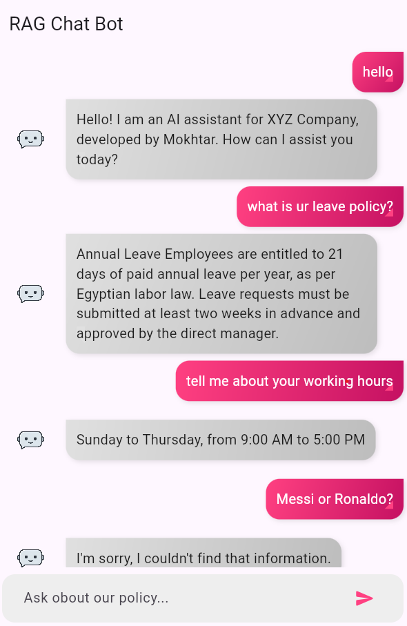

# 🚀 Intelligent RAG Chatbot – .NET, Python (LangChain), SQL & Flutter  

## **🌟 Project Overview**  
This project is an **intelligent chatbot** that seamlessly integrates **.NET Web API**, **Python AI Backend (LangChain)**, **SQL Database**, and a **Flutter UI** to create a **powerful RAG (Retrieval-Augmented Generation) chatbot**.  

### **🔍 How It Works?**  
1️⃣ A user sends a query via the **Flutter chat UI**.  
2️⃣ The **.NET Web API** receives the request and forwards it to the **Python AI backend**.  
3️⃣ The **Python backend (LangChain)** retrieves relevant information from **embedded text documents** and generates a response using an **FLAN-T5**.  
4️⃣ The **.NET API logs the interaction** in an **SQL database** and returns the response to the user.  
5️⃣ The **Flutter UI displays the chatbot’s response** in a sleek and interactive chat interface.  

---

## **📌 Features**  

### **💻 .NET Web API (Backend Layer)**  
✅ Accepts user questions via **HTTP POST (async requests)**.  
✅ Forwards the user’s query to the **Python AI backend**.  
✅ Receives the chatbot’s response and sends it back to the user.  
✅ Logs user interactions (**queries & responses**) in an **SQL database** for tracking and analysis.  

### **🧠 Python AI Backend (LangChain)**  
✅ Uses **LangChain** to **embed and index text documents** for retrieval.  
✅ Implements a **RAG pipeline**:  
   - **Retrieve:** Finds relevant text chunks from the documents.  
   - **Generate:** Uses an **FLAN-T5** to form a meaningful response.  
✅ Returns accurate responses to the .NET API.  

### **🗄️ SQL Database (Logging & Analysis)**  
✅ Stores **user queries** with timestamps.  
✅ Logs **chatbot responses** for analytics & debugging.  

### **📱 Flutter Chat UI (User Interface)**  
✅ Beautiful, **real-time chat interface** with message bubbles.  
✅ Supports **user input & bot responses** dynamically.  
✅ Smooth animations for an engaging experience.  

---

## **🛠️ Tech Stack**  
| Component  | Technology Used |
|------------|----------------|
| **Frontend** | Flutter (Dart) |
| **Backend (API Layer)** | .NET Core Web API (C#) |
| **AI Backend** | Python, LangChain, HuggingFace |
| **Database** | SQLLite |
| **Embedding Model** | FAISS |

---

## **⚙️ Setup Guide**  

### **🔧 Prerequisites**  
Ensure you have the following installed:  
- **.NET SDK**  
- **Python 3.9+**  
- **SQLlite**  
- **LangChain, FAISS, Huggingface**  
- **Flutter SDK**  

---

### **📌 Backend Setup**  

#### **1️⃣ Clone the Repository**  
```sh
git clone https://github.com/Mokhtar628/RAG_chatbot/
cd rag-chatbot
```

#### **2️⃣ Setup Python Backend (AI Layer)**  
```sh
cd backend-python
pip install -r requirements.txt
python app.py
```
> This starts the Python **AI backend (LangChain RAG)**.

#### **3️⃣ Setup .NET Web API**  
```sh
cd ../backend-dotnet
dotnet restore
dotnet run
```
> This runs the **.NET API** to handle requests.

#### **4️⃣ Setup SQL Database**  
Run the SQL schema to create tables (or initialize and enable migration from the code):  
```sql
CREATE TABLE ChatLogs (
    Id INT PRIMARY KEY IDENTITY(1,1),
    UserId NVARCHAR(50) NOT NULL DEFAULT 'anonymous',
    Question NVARCHAR(MAX) NOT NULL,
    Answer NVARCHAR(MAX) NOT NULL,
    Timestamp DATETIME NOT NULL DEFAULT GETUTCDATE()
);
```
> I used a default userID
> Now, your **database is ready!** 🎉

---

### **📱 Flutter Chat UI Setup**  

#### **1️⃣ Install Dependencies**  
```sh
cd flutter-chat
flutter pub get
```

#### **2️⃣ Run the App**  
```sh
flutter run
```
> Open the app in an **Android/iOS simulator** or **Browser**.

---

## **📌 API Endpoints**  

### **1️⃣ .NET Web API (C#)**
| Method | Endpoint | Description |
|--------|----------|-------------|
| **POST** | `/api/chatbot/ask` | Receives a user question, forwards it to Python backend, logs the interaction, and returns the chatbot’s response. |

### **2️⃣ Python AI Backend (Flask API)**
| Method | Endpoint | Description |
|--------|----------|-------------|
| **POST** | `/ask` | Accepts user questions, retrieves relevant info, generates a response using LLM, and returns the result. |

---

# Project Design Decisions

This document outlines the design decisions for the three main components of the chatbot system: Python Backend, .NET API, and Flutter UI.

---

## 📌 Python Backend

### 🔹 Model & Embeddings
- The backend uses **`google/flan-t5-large`** as the language model due to its strong performance in text generation, fast inference and reasoning tasks.  
- **`all-mpnet-base-v2`** is used for text embeddings because of its high accuracy in semantic similarity tasks.  
- FAISS (Facebook AI Similarity Search) is used as the vector database for efficient similarity-based retrieval.  

### 🔹 Experimentation & Optimization
- Multiple prompt templates and hyperparameters were tested to fine-tune the retrieval-augmented generation (RAG) process.  
- Parameters such as top-k retrieval, temperature and etc were adjusted to balance response accuracy and relevance.  

🔗 **Resources:**  
- [FLAN-T5 on Hugging Face](https://huggingface.co/google/flan-t5-large)  
- [MPNet on Sentence-Transformers](https://www.sbert.net/docs/pretrained_models.html)  
- [FAISS Documentation](https://faiss.ai/)  
- [All-MiniLM-L6-v2 Model (Hugging Face)](https://huggingface.co/sentence-transformers/all-mpnet-base-v2)  
- [Comparison of State-of-the-Art Sentence Transformers](https://www.sbert.net/docs/sentence_transformer/pretrained_models.html)  
- [Comparison of Different Vector Store Models (LangChain)](https://python.langchain.com/docs/integrations/vectorstores/)  
- [Top 7 Vector Databases for 2025 (DataCamp)](https://www.datacamp.com/blog/the-top-5-vector-databases)


---

## 📌 .NET Web API

### 🔹 Services & Structure
The project follows a structured service-based architecture, including:  
- **Services:** Handles business logic.  
- **Models:** Defines data structures.  
- **Controllers:** Manages API endpoints.  
- **Data:** Manages database interactions.  

### 🔹 SQLite Database Choice  
- SQLite was chosen for simplicity and portability, as this is a lightweight application.  
- A single-table schema was used instead of a **one-to-many** relational model to avoid redundancy while maintaining a simple logging mechanism.  

---

## 📌 Flutter Frontend

### 🔹 Architecture & State Management
- **Clean Architecture** was implemented for scalability and maintainability.  
- **BLoC (Business Logic Component)** was used for efficient state management.  

### 🔹 UI Preview  
Below is a screenshot of the chat UI:

  

---

## 📌 Project Structure

```
📂 Project Root
 ├── 📂 Python_Backend
 │    ├── app.py
 │    ├── services/
 │    ├── data/
 │    ├── vector_database/
 │    └── ...
 ├── 📂 DotNet_API
 │    ├── Controllers/
 │    ├── Services/
 │    ├── Models/
 │    ├── Data/
 │    ├── appsettings.json
 │    └── ...
 ├── 📂 Flutter_App
 │    ├── lib/
 │    │    ├── main.dart
 │    │    ├── features/
 │    │    ├── core/
 │    │    └── ...
 │    ├── pubspec.yaml
 │    ├── assets/
 │    └── ...
```

This structure ensures a modular and maintainable codebase for all three components.

---


## **🌟 Future Enhancements**  
🔹 Add **user authentication** for personalized responses.  
🔹 Extend **Flutter UI** with **voice input & chatbot avatars**.  
🔹 Deploy API using **Docker** for scalability.  

---

## **🤝 Contributing**  
We welcome contributions! 🚀  
1. Fork the repository.  
2. Create a new branch (`feature-new`).  
3. Commit changes and push.  
4. Open a Pull Request.  

---

## **📞 Contact & Support**  
💡 Need help? Reach out via:  
📧 **Email:** mohmedmokhtar2002@gmail.com  
💬 **Discord:** username: mokh_  

---

### **🚀 Built with Passion ❤️ – Happy Coding!**  
